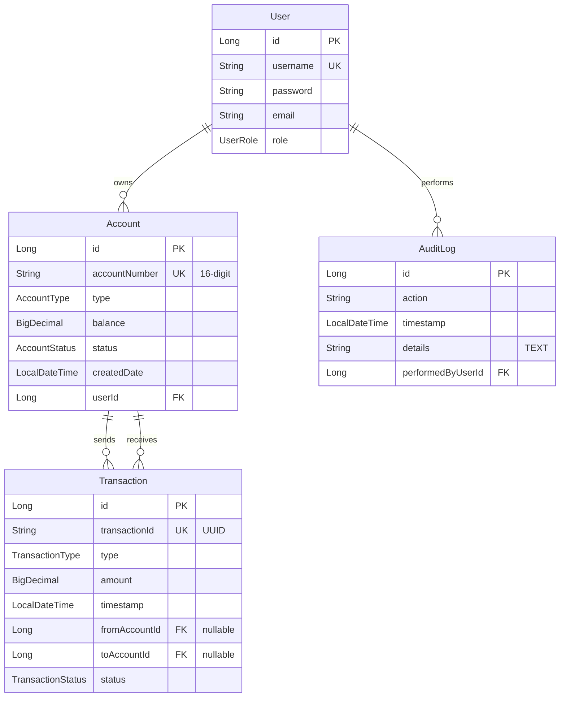

# IronVault Banking System - Entity Relationship Diagram

This document describes the database schema and relationships for the IronVault Banking System.

## ER Diagram (Mermaid)

## Entity Details

### 1. User
Represents system actors (Customers, Employees, Administrators).
* `id` (Long, PK): Auto-incremented primary key.
* `username` (String, Unique, Not Null): Login credential.
* `password` (String, Not Null): Bcrypt hashed password.
* `email` (String, Not Null): Contact address.
* `role` (UserRole Enum, Not Null): Enumeration specifying access privileges (`CUSTOMER`, `EMPLOYEE`, `ADMIN`).

### 2. Account
Represents checking or savings accounts owned by customers.
* `id` (Long, PK): Auto-incremented primary key.
* `accountNumber` (String, Unique, Not Null): 16-digit account identifier.
* `type` (AccountType Enum, Not Null): Account type (`CHECKING`, `SAVINGS`).
* `balance` (BigDecimal, Not Null): Account balance with precision 15, scale 2.
* `status` (AccountStatus Enum, Not Null): Account status (`ACTIVE`, `SUSPENDED`, `CLOSED`).
* `createdDate` (LocalDateTime, Not Null): Timestamp of account creation (automatically set).
* `userId` (Long, FK): Reference to the owning user.

### 3. Transaction
Represents transactions (Deposits, Withdrawals, Transfers).
* `id` (Long, PK): Auto-incremented primary key.
* `transactionId` (String, Unique, Not Null): Public unique reference identifier (UUID).
* `type` (TransactionType Enum, Not Null): Transaction type (`DEPOSIT`, `WITHDRAWAL`, `TRANSFER`).
* `amount` (BigDecimal, Not Null): Value transferred.
* `timestamp` (LocalDateTime, Not Null): Transaction execution timestamp.
* `fromAccountId` (Long, FK, Nullable): Source account reference (null for deposits).
* `toAccountId` (Long, FK, Nullable): Target account reference (null for withdrawals).
* `status` (TransactionStatus Enum, Not Null): Transaction status (`PENDING`, `COMPLETED`, `FAILED`).

### 4. AuditLog
Captures critical actions performed on the platform for security auditing.
* `id` (Long, PK): Auto-incremented primary key.
* `action` (String, Not Null): Action description.
* `performedByUserId` (Long, FK): User who initiated the action.
* `timestamp` (LocalDateTime, Not Null): Event timestamp.
* `details` (String): Additional metadata logged as unstructured TEXT.
