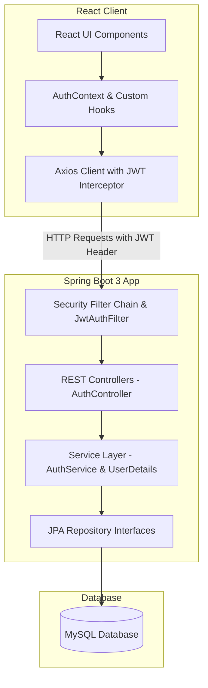

# IronVault Banking System
### Software Design Lab Submission

IronVault is a secure online banking system designed to address modern security requirements. This project comprises a stateless Spring Boot 3 backend and a responsive, dynamic React (Vite) frontend.

---

## 1. Project Overview

The IronVault Banking System provides customers, employees, and administrators with a secure platform to access financial dashboards, manage accounts, and audit activities. The project incorporates rigorous enterprise-grade security policies such as role-based access control (RBAC), automatic account lockouts on brute-force detection, session inactivity timeouts via JWT claims, password age limits, and strict password reuse constraints.

---

## 2. Tech Stack

### Backend
* **Core Framework**: Java 17, Spring Boot 3.3.1
* **Web Security**: Spring Security (Stateless, Filter-based)
* **Data Access**: Spring Data JPA (Hibernate ORM)
* **Database**: PostgreSQL (Driver included)
* **Token Utility**: JJWT (Java JWT library) 0.12.6
* **Validation**: Jakarta Validation API (JSR-380)
* **Boilerplate Reduction**: Lombok

### Frontend
* **Core Framework**: React (Vite environment)
* **Styling**: Tailwind CSS v3
* **Routing**: React Router Dom v6
* **HTTP Client**: Axios (configured with request interceptor for header authorization)
* **Animations**: Framer Motion
* **Icons**: Lucide React

---

## 3. System Architecture Diagram



---

## 4. Environment Variables

The backend application is configured using `application.yml` and can be customized with the following environment variables:

| Variable | Description | Default Value |
| :--- | :--- | :--- |
| `DATABASE_URL` | JDBC database connection string | `jdbc:mysql://localhost:3306/ironvault_db` |
| `DATABASE_USERNAME` | MySQL database user | `user_ironvault` |
| `DATABASE_PASSWORD` | MySQL database password | `password123` |
| `JWT_SECRET` | 256-bit cryptographically secure key for JWT signatures | `placeholder_jwt_secret_key_must_be_at_least_256_bits_long_for_security_reasons_1234567890` |
| `JWT_EXPIRY_MS` | Lifetime of the JWT token (in milliseconds) | `1800000` (30 minutes) |

---

## 5. API Endpoint Summary

| HTTP Method | Endpoint | Access Control | Request DTO | Response / Action |
| :--- | :--- | :--- | :--- | :--- |
| **POST** | `/api/auth/register` | Permit All | `RegisterRequest` | Returns JWT token, username, email, and `CUSTOMER` role. |
| **POST** | `/api/auth/login` | Permit All | `LoginRequest` | Verifies email/password. Increments failed attempts on failure. Logs audits. Returns JWT + role. |
| **POST** | `/api/auth/logout` | Authenticated | None | Records logout audit log event. Client discards local token. |
| **GET** | `/api/customer/**` | `ROLE_CUSTOMER` | None | Secure endpoints for banking operations. |
| **GET** | `/api/employee/**` | `ROLE_EMPLOYEE` | None | Secure endpoints for account and transfer audits. |
| **GET** | `/api/admin/**` | `ROLE_ADMIN` | None | Administrative control and auditing logs. |

---

## 6. SRS Traceability Matrix

This table maps specific Software Requirements Specification (SRS) items to the architectural modules that implement them:

| Requirement Description | Backend Component | Frontend Component | Satisfied Status |
| :--- | :--- | :--- | :--- |
| **Email + Password Login** | `AuthService.java`, `CustomUserDetailsService.java` | `Login.jsx` | Completed |
| **BCrypt Password Hashing** | `SecurityConfig.java` (BCryptPasswordEncoder bean) | N/A (Handled server-side) | Completed |
| **30-Min Session Expiry** | `application.yml` (`expiry-ms`), `JwtTokenProvider.java` | N/A (Standard JWT validation failure) | Completed |
| **Account Lockout (5 attempts)** | `User.java` (fields: `failedAttempts`, `accountLocked`, `lockedUntil`), `AuthService.java` | `Login.jsx` (displays error message) | Completed |
| **Password Min Size (8 chars)** | `RegisterRequest.java` (`@Size(min=8)`) | `Login.jsx` (form input constraint) | Completed |
| **90-Day Password Expiration** | `User.java` (`passwordLastChanged`), `AuthService.java` | N/A (Throws credentials expired exception) | Completed |
| **Prevent Last 3 Passwords** | `PasswordHistory.java`, `AuthService.java` (`changePassword`) | N/A (Server-side evaluation) | Completed |
| **Role-Based Access Control** | `SecurityConfig.java`, `UserRole.java` | `App.jsx` (Route guards and redirects) | Completed |
| **Audit Logging System** | `AuditLog.java`, `AuditLogRepository.java`, `AuthService.java` | N/A (System telemetry) | Completed |

---

## 7. How to Run Locally

### Prerequisites
* Java Development Kit (JDK) 17+
* Maven 3.6+
* Node.js v18+
* MySQL Database Server running locally

### Database setup (Linux)
1. Enter mysql as root user
    ```bash
    sudo mysql -u root -p    # Linux
    ```
2. Create a new user and database for the application
    ```bash
    CREATE USER 'user_ironvault'@'localhost' IDENTIFIED BY 'password123';
    CREATE DATABASE ironvault_db;
    GRANT ALL PRIVILEGES ON ironvault_db.* TO 'user_ironvault'@'localhost';
    FLUSH PRIVILEGES;
    ```

### Running the Backend
1. Navigate to backend directory:
    ```bash
    cd ironvault-backend
    ```
2. Build and execute the application:
   ```bash
   mvn clean compile
   mvn spring-boot:run
   ```

### Running the Frontend
1. Navigate to the frontend directory:
   ```bash
   cd ironvault-frontend
   ```
2. Install npm dependencies:
   ```bash
   npm ci
   ```
3. Run the Vite development server:
   ```bash
   npm run dev
   ```
4. Access the client application in your web browser at `http://localhost:5173`.
